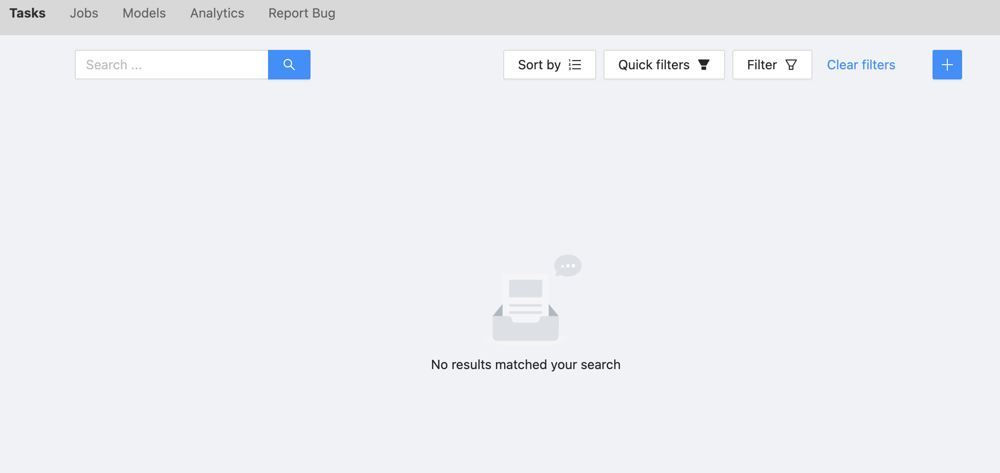
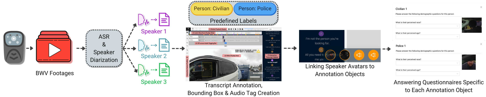

# CVAT-BWV: A Web-Based Video Annotation Platform for Police Body-Worn Video


## Abstract

We introduce an open-source platform for annotating body-worn video (BWV) footage aimed at enhancing transparency and accountability in policing. Despite the widespread adoption of BWVs in police departments, analyzing the vast amount of footage generated has presented significant challenges. This is primarily due to resource constraints, the sensitive nature of the data, which limits widespread access, and consequently, lack of annotations for training machine learning models. Our platform, called CVAT-BWV, offers a secure, locally hosted annotation environment that integrates several AI tools to assist in annotating multimodal data. With features such as automatic speech recognition, speaker diarization, object detection, and face recognition, CVAT-BWV aims to reduce the manual annotation workload, improve annotation quality, and allow for capturing perspectives from a diverse population of annotators. This tool aims to streamline the collection of annotations and the building of models, enhancing the use of BWV data for oversight and learning purposes to uncover insights into police-civilian interactions.

We have based our framework on [Computer Vision Annotation Tool (CVAT)](https://github.com/opencv/cvat), as it is an open-source annotation software that natively supports object detection and image classification. Moreover, it offers the flexibility of local hosting and the customizability inherent in open-source programs.

## Demo
https://www.youtube.com/watch?v=LyfLsG8OQug

## Prerequisites

The only prerequisite for running the platform is to have Docker and Docker Compose installed on your machine. If you don't have Docker installed, you can follow the instructions [here](https://docs.docker.com/get-docker/).

## Getting Started

### Installation

```sh
# download and install nuclio to run inference on the models
wget https://github.com/nuclio/nuclio/releases/download/1.8.14/nuctl-1.8.14-linux-amd64
sudo chmod +x nuctl-1.8.14-linux-amd64
sudo ln -sf $(pwd)/nuctl-1.8.14-linux-amd64 /usr/local/bin/nuctl

# install the models
./serverless/deploy_cpu.sh serverless/custom/facematcher-deepface
./serverless/deploy_cpu.sh serverless/pytorch/ultralytics/yolov8

# verify the models are correctly installed
nuctl get functions

# build and run the platform
docker compose -f docker-compose.yml -f components/serverless/docker-compose.serverless.yml up -d
```

### Creating an Admin user

You can use the following command to create an admin user. After running the command, you will be prompted to enter a username, email, and password for the admin user.

```sh
docker exec -it cvat_server bash -ic 'python3 ~/manage.py createsuperuser'
```

### Hosting the platform on custom domain / IP

You can host the platform on a custom domain or IP by setting the `CVAT_HOST` environment variable.

```sh
export CVAT_HOST=<YOUR-HOST>
```

### Task Creation

As an admin user, you can create a new task by clicking on the `+` button on the top right of the dashboard.


### Adding diarized transcripts for the task

For adding diarized transcripts, please follow the steps below:

<!-- TODO: -->

# Features and Workflow of the Platform



### 1. Audio/Video Annotation

Annotators can draw bounding boxes or use the auto annotation tool to put annotation tags on the video.
These tags for the purposes of Police Body Worn Video could be `Police Officer`, `Police Officer (Primary)`, `Civilian`, `Police Car`, `Civilian Car`, etc.

Whenever a new person bounding box is added, the face recognition module will run automatically to match it with previous bounding boxes. It will show an alert popup if it detects a match.

Users can add audio annotations by clicking the dropdown on the top of the video. This reveals the audio annotation space, where new annotation objects can be added by clicking the `+`.


### 2. Transcript Annotation

The interactive transcript sidebar shows the (at-first auto-generated) transcripts.
Every utterance of the transcript can be edited. An annotator can:

1. Edit the text of an utternace
2. Change the speaker of the utternace
3. Add an utterance
4. Delete an utterance


Users can map the audio/video annotation tags to the transcript utterances by right-clicking the avatars on the top of each utterace and then selecting the approapriate annotation object. Once a mapping is applied for one of the utterances, the same mapping is automatically applied to all utterances of that color.


### 3. Questionnaire Annotation

The platform can serve a questionnaire to be answered for the annotation objects created in the previous steps.

