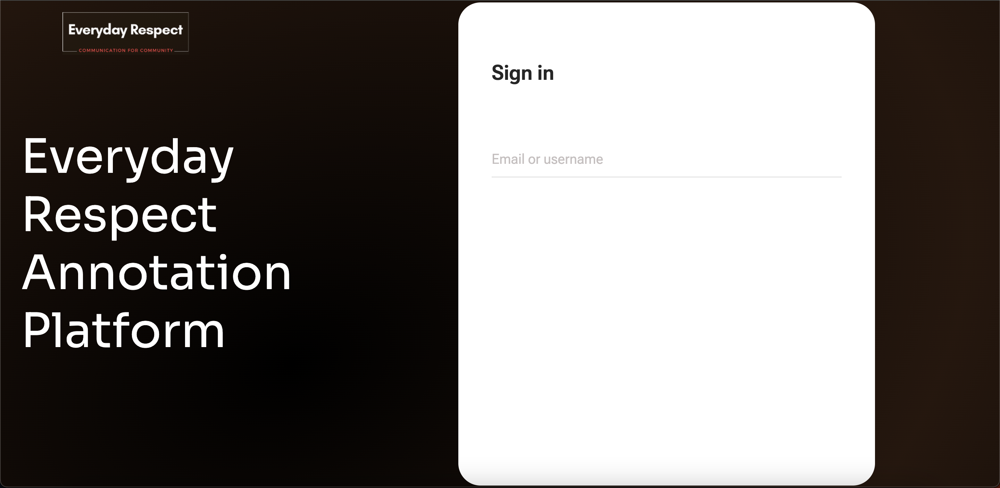
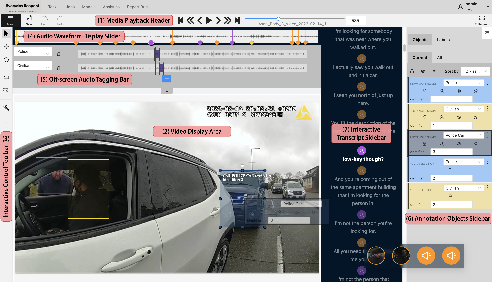
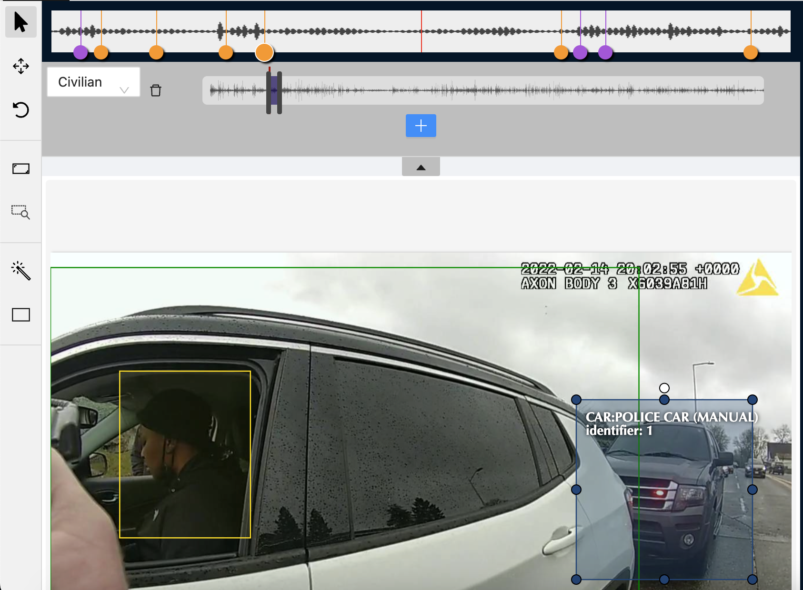
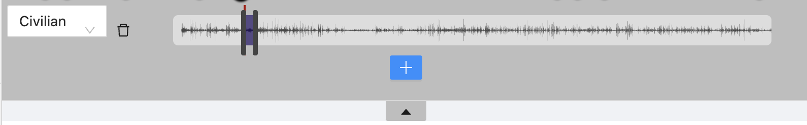
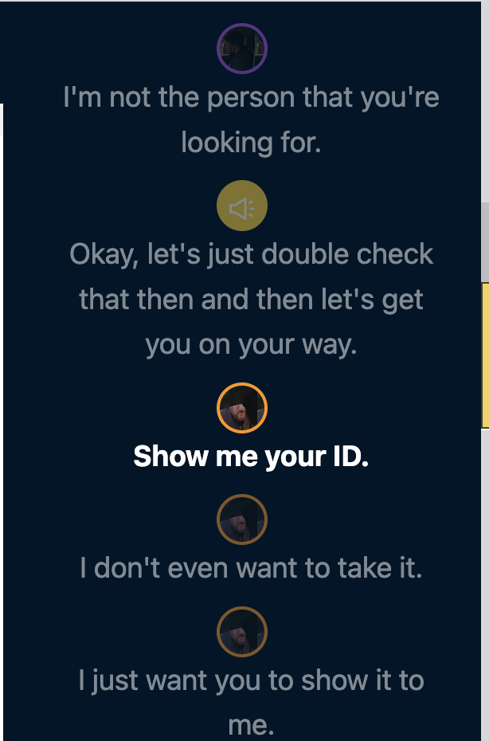
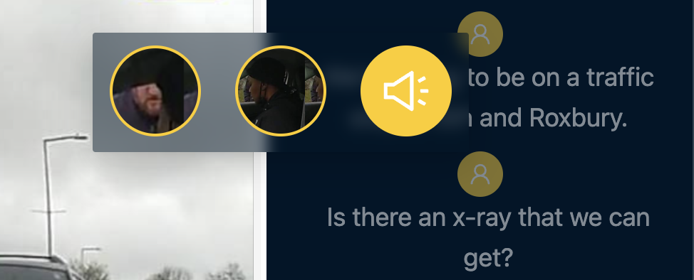
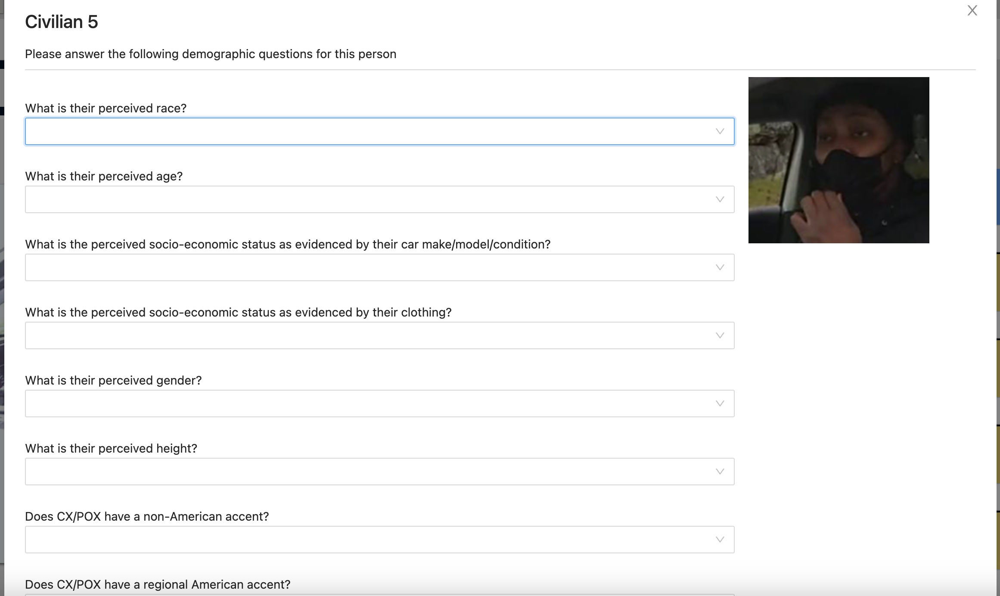

# CVAT-BWV: A Web-Based Video Annotation Platform for Police Body-Worn Video

CVAT-BVW is an interactive video annotation focused on police body worn videos tool and is based on OpenCV's [CVAT](https://github.com/opencv/cvat)  
As a multi-modal platform, it supports annotations for transcripts, auditory content, and visual entities, all of which are enhanced by AI-assisted annotation tools

### Installation
```sh
# download and install nuclio to run inference on the models
wget https://github.com/nuclio/nuclio/releases/download/1.8.14/nuctl-1.8.14-linux-amd64
sudo chmod +x nuctl-1.8.14-linux-amd64
sudo ln -sf $(pwd)/nuctl-1.8.14-linux-amd64 /usr/local/bin/nuctl

# install the models
./serverless/deploy_cpu.sh serverless/custom/facematcher-deepface
./serverless/deploy_cpu.sh serverless/pytorch/ultralytics/yolov8

# verify the models are correctly installed
nuctl get functions

# build and run the platform
docker compose -f docker-compose.yml -f components/serverless/docker-compose.serverless.yml up -d
```


### Creating an Admin user
Run
```sh
docker exec -it cvat_server bash -ic 'python3 ~/manage.py createsuperuser'
```
and set the new credentials when prompted.


### Hosting on custom domain / IP
Set this before doing docker compose up
```sh
export CVAT_HOST=<YOUR-HOST>
```

# UI
#### Login Screen


#### Annotation Screen


# Features
### Audio/Video Annotation

Users can draw bounding boxes or use the auto annotation tool to put annotation tags on the video.
These tags for the purposes of Police Body Worn Video could be `Police Officer`, `Police Officer (Primary)`, `Civilian`, `Police Car`, `Civilian Car`, etc

On every new person annotation added, the face recognition model will run automatically to match it with previous tags. It will show an alert popup if it detects a match.


Users can add audio annotations by clicking the dropdown on the top of the video. This reveals the audio annotation speace, where new annotation objects can be added by clicking the `+`.
### Transcript Annotation

The annotation page displays the (at-first auto-generated) transcript in the Transcript Sidebar.
Every utterance of the transcript can be edited. A user can:
1. edit the text of an utternace
2. change the speaker of the utternace
3. add an utterance
4. delete an utterance

Users can map the audio/video annotation tags to the transcript utterances by right-clicking the avatars on the top of each utterace and then selecting the approapriate annotation object.

Once a mapping is applied for one of the utterances, the same mapping is automatically applied to all utterances of that color.

### Questionnaire Annotation

The platform can serve a questionnaire to be answered for the annotation tags.

